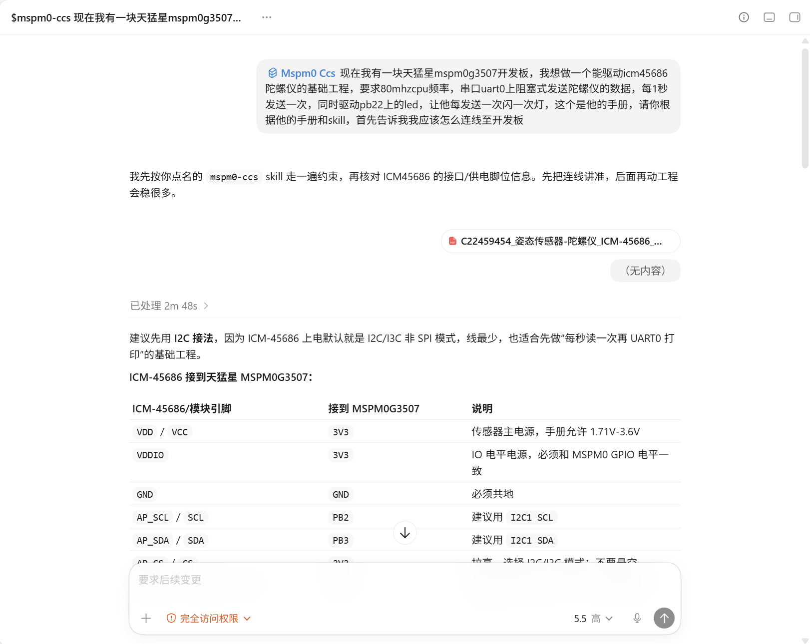
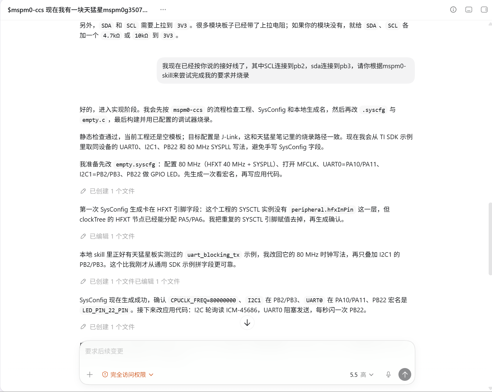
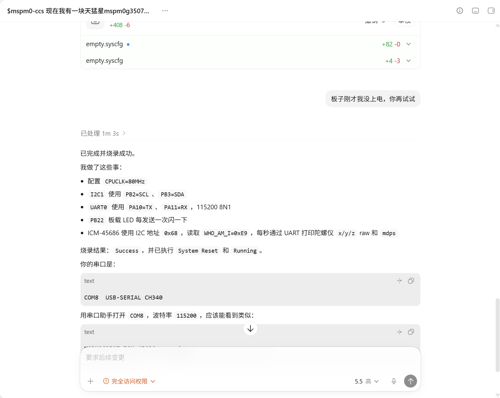
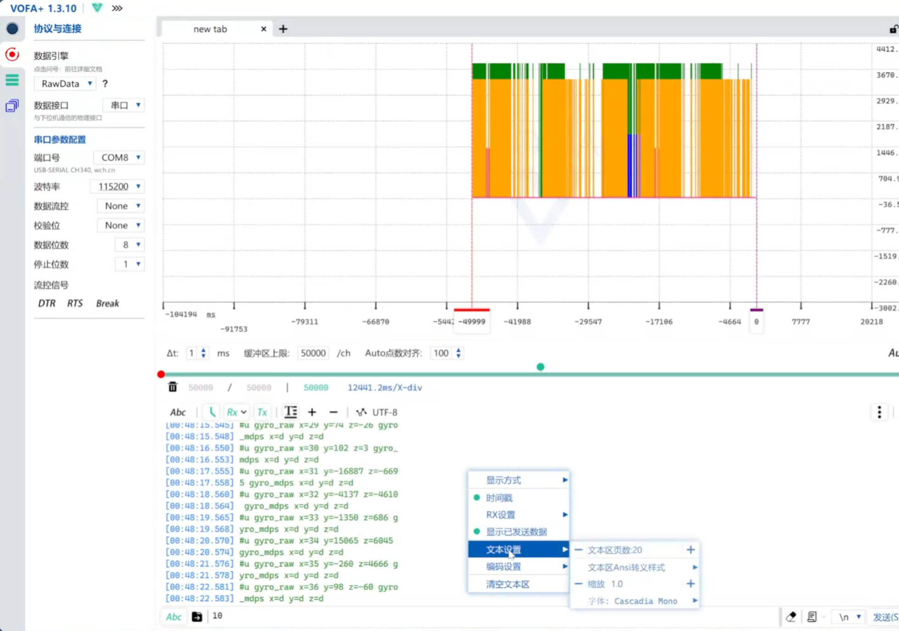

# MSPM0Skill

面向 TI MSPM0 +  SysConfig + DriverLib 的 AI 编程助手 skill 包。

本项目主要服务于国内 MSPM0 开发、电赛备赛和 TI官方开发板/立创天猛星等 MSPM0G3507 使用场景，帮助 Claude Code、OpenCode、OpenClaw、Continue、Cursor、Codex 等 CLI / 编辑器 Agent 更安全地理解和修改 MSPM0 工程。它也补充了对常见 Keil/uVision、CMake + GCC + OpenOCD 工程布局的适配说明。


## 主要功能
### 提供对 MSPM0 + SysConfig/DriverLib 工程的支持，使 AI Agent:
* **引脚配置**：通过 CLI 修改 `.syscfg` 文件初始化外设引脚
* **代码修改**：修改底层/应用层逻辑，自动编译并烧录到开发板
* **调试辅助**：串口数据接收、自动断点调试、`.syscfg` / 工程文件自动检查
* **例程管理**：无现成例程时自动查找官方例程文件
* **参数调优**：电机/舵机等结构的自动调参和逻辑优化
* **模块驱动**：提供某个模块的手册并要求Agents驱动/设计算法等
* **个性化定制**：可以要求Agents把自己的项目融合进Skill

## 目录结构

```text
mspm0-skill/
├─ README.md
├─ AGENTS.md
├─ CLAUDE.md
└─ skills/
   └─ mspm0-ccs/
      ├─ SKILL.md
      ├─ references/
      ├─ scripts/
      ├─ assets/
      │  └─ snippets/
      └─ examples/
```

## 安装方式

### 快速安装

```bash
npx skills add mc3545dada/mspm0-skill@mspm0-ccs
```
### 手动安装

### Claude Code

把 `skills/mspm0-ccs/` 复制到：

```text
~/.claude/skills/mspm0-ccs/
```

Windows PowerShell 示例：

```powershell
New-Item -ItemType Directory -Force "$env:USERPROFILE\.claude\skills" | Out-Null
Copy-Item -Recurse -Force .\skills\mspm0-ccs "$env:USERPROFILE\.claude\skills\mspm0-ccs"
```

### Codex / OpenCode / OpenClaw / 兼容 Agents 技能目录的工具

常见安装位置：

```text
~/.agents/skills/mspm0-ccs/
项目目录/.agents/skills/mspm0-ccs/
```

Windows PowerShell 示例：

```powershell
New-Item -ItemType Directory -Force "$env:USERPROFILE\.agents\skills" | Out-Null
Copy-Item -Recurse -Force .\skills\mspm0-ccs "$env:USERPROFILE\.agents\skills\mspm0-ccs"
```

OpenClaw 如果使用自己的技能目录，也可以复制到：

```text
~/.openclaw/skills/mspm0-ccs/
```

## Skill 内容

```text
skills/mspm0-ccs/
├─ SKILL.md
├─ references/
│  ├─ sysconfig_ccs_workflow.md
│  ├─ driverlib_runtime_rules.md
│  ├─ sdk_schema_lookup.md
│  ├─ hardware_validation_notes.md
│  └─ ccs_dss_debug.md
├─ scripts/
│  ├─ capture_example.py
│  ├─ check_syscfg.py
│  ├─ list_examples.py
│  ├─ serial_console.py
│  ├─ index_syscfg_examples.py
│  └─ ccs_dss_debug.py
├─ assets/
│  ├─ snippets/
│  │  ├─ clock_80mhz_mfclk.syscfg.md
│  │  ├─ gpio_output_led.syscfg.md
│  │  ├─ uart0_blocking_tx.syscfg.md
│  │  └─ mspm0g3507_lqfp64_empty_scaffold.syscfg.md
│  └─ screenshots/
└─ examples/
   ├─ empty_project/
   ├─ led_blink/
   ├─ uart_blocking_tx/
   └─ pwm_breath_led/
```

## 已验证环境

我目前使用的组合是：

- 开发板：立创天猛星 MSPM0G3507
- 开发环境：CCS / CCS Theia
- SDK：MSPM0 SDK 2.10.00.04
- SysConfig：1.26.2
- 编译器：TI Arm Clang 4.0.3 LTS
- 烧录器：J-Link
- 烧录工具：UniFlash / DSLite
- 验证外设：PB22 板载 LED、UART0 阻塞发送等

其他开发板、芯片封装、SDK/CCS/Keil/CMake 版本、调试器或烧录方式可能也能使用本项目规则，简单测试发现同样支持Keil+Syscfg环境,CMake+OpenOCD工具链等，但尚未百分百确认。迁移到其他组合时，应先运行静态检查和最小外设验证。

## 使用方式

### 对已有的M0项目使用
 - 建议对你的项目文件做一个描述，或设计一个AGENTS.md文件供其参考
 - 或者让Agent 读懂你的项目后直接使用即可
 - 如读串口调电机参数/写算法/初始化外设/更改项目结构等

### 从头开始
 - 将skill添加到你的Agent工具后，使用它打开你的 MSPM0 项目文件夹
 - 按你的工程工具链至少成功编译一次项目，然后配置你的烧录器
 - 之后开始 Vibe Coding~

---
安装后，在 MSPM0 工程里可以这样要求 Agent：

```text
请使用 mspm0-ccs skill，先检查当前工程的 `system.syscfg`和 `ti_msp_dl_config.h`，
然后帮我安全地配置天猛星 PB22 板载 LED。
```

或者：

```text
请使用 mspm0-ccs skill，参考 UART0 blocking TX 示例，
检查当前工程的 UART SysConfig、生成宏和串口发送代码。
```

## 使用示例

### 使用Claude Code简单做一个闪灯项目

下面是 Claude Code 中调用本 skill 配置 MSPM0g3507 点灯工程、编译和烧录的实际使用示例：


### 使用Codex从头开始做陀螺仪(icm45686)驱动同时配置串口

下面是 Codex 中调用本 skill 配置 MSPM0g3507 写陀螺仪驱动、编译和烧录的实际使用示例：









- 同时我录制了完整使用视频，详见：[Bilibili 完整使用视频](https://www.bilibili.com/video/BV1RbLY6xECu)

## 脚本

Agent会在需要时自动使用对应脚本，以下为脚本单独使用示例：

静态检查当前 MSPM0 工程：

```powershell
python skills\mspm0-ccs\scripts\check_syscfg.py C:\Users\3545\workspace_ccstheia\26testproject1
```

串口接收测试：

```powershell
python skills\mspm0-ccs\scripts\serial_console.py --list
python skills\mspm0-ccs\scripts\serial_console.py -p COM6 -b 115200 --timestamp --duration 10
```

CCS-DSS 调试链路测试（仅适用于 CCS / CCS Theia / UniFlash Debug Server Scripting 这条线，不是 OpenOCD/GDB）：

```powershell
python skills\mspm0-ccs\scripts\ccs_dss_debug.py C:\Users\3545\workspace_ccstheia\26testproject2 probe --leave-running
python skills\mspm0-ccs\scripts\ccs_dss_debug.py C:\Users\3545\workspace_ccstheia\26testproject2 run-to-symbol --symbol main --load --reset "System Reset"
```

索引本地 TI MSPM0 SDK 的官方 SysConfig 例程和模块 metadata：

```powershell
python skills\mspm0-ccs\scripts\index_syscfg_examples.py C:\ti\mspm0_sdk_2_10_00_04 --board LP_MSPM0G3507 --module UART
```

列出当前 skill 内已经整理好的例程：

```powershell
python skills\mspm0-ccs\scripts\list_examples.py
```

把自己的 CCS 工程提炼成 skill 兼容例程：

```powershell
python skills\mspm0-ccs\scripts\capture_example.py C:\Users\3545\workspace_ccstheia\my_project `
  --name my_uart_example `
  --include "*.c" `
  --include "app\*.c" `
  --include "app\*.h" `
  --board "LCKFB Tianmengxing MSPM0G3507"
```

复杂工程建议显式写 `--include`，只打包和例程主题相关的 `.c/.h` 文件；不要直接把完整 CCS 工程、`Debug/`、`.out` 或生成文件放进 `examples/`。

如果 VOFA+ 或其他串口助手已经打开同一个 COM 口，Python 会无法打开该串口。测试 Python 工具前需要先关闭占用串口的软件。

## 关键经验

- `.syscfg` 是引脚、外设、时钟和生成代码的源配置文件。
- 不要手动修改 `ti_msp_dl_config.c` / `ti_msp_dl_config.h`。
- 修改 `.syscfg` 后，需要重新运行 SysConfig 或重新构建当前工程。
- 不要猜生成函数和宏名，先查看生成的 `ti_msp_dl_config.h`。
- 如果用户缺少关键参数，应先参考已验证例程/官方例程，或者在执行前询问并给出推荐默认值。
- 驱动外部模块时，应尽量索要数据手册、接线方式、供电电压、协议参数和关键时序。
- 如果多次驱动失败且代码、SysConfig、编译、烧录都看起来正确，应提醒用户排查硬件连接、供电、模块模式和测试方法。
- 新建 Keil/CCS 工程通常需要先手动编译一次，生成对应的工程输出目录与链接文件，例如 `Debug/`、`Objects/`、`Listings/`、`.out` 或 `.axf`。CMake 工程通常需要已有配置好的 build 目录或 preset/toolchain。
- 烧录前必须确认 CCS 的 `targetConfigs/*.ccxml`、Keil 工程的调试器配置，或 OpenOCD 的 `.cfg` 文件和实际烧录器一致。
- 自动烧录建议使用 DSLite System Reset：`-e -r 2 -u`。
- 当前已整理的自动调试辅助是 CCS-DSS 方向：依赖 CCS/CCS Theia/UniFlash 的 Debug Server Scripting 和 `targetConfigs/*.ccxml`。它不只限于 J-Link，理论上也可用于 XDS110 等 CCS 支持的调试器，但必须以 `.ccxml` 和实际硬件一致为前提。
- CCS-DSS 调试和 OpenOCD/GDB 调试应分开处理；后续如果补 OpenOCD 调试经验，建议作为单独后端记录。
- OpenOCD 方式需要使用支持 MSPM0 的 TI 扩展分支/构建；`unable to find a matching CMSIS-DAP device` 通常表示没有找到对应调试器，不等于固件编译失败。

## 例程说明

- `examples/` 是主要例程参考目录，Agent 会优先通过 `manifest.json` 快速选择相近例程。
- 每个例程包含 `example.syscfg`、`README.md`、`manifest.json` 和 `src/`。
- 如果你想让Agents按你的风格来初始化项目，尝试要求它把你曾做过的参考项目融合进skill，它会自动调用工具来融合你的项目进入`examples/`目录
- 如果当前例程不覆盖用户需求，Agent 会使用附带工具搜索本机 TI SDK 官方例程。
- 用户自己的项目不要整工程直接扔进 `examples/`；建议要求Agents使用 `capture_example.py` 抽取成精简例程包。
---
以下为我预装的简单examples，你也可以移除他们
- `examples/empty_project/`：未编译空工程基线，默认 32MHz 风格。
- `examples/led_blink/`：PB22 LED 32MHz 闪灯基线。
- `examples/uart_blocking_tx/`：80MHz CPUCLK + UART0 阻塞发送字符串基线。
- `examples/pwm_breath_led/`：80MHz CPUCLK + PB22 / TIMG8_CCP1 PWM 呼吸灯基线。

## 后续计划

- 增强 Python 串口收发工具。
- 增加自动烧录封装。
- 完善 OpenOCD 烧录封装和更多探针组合验证。
- 增加更多例程。
- 完善 PID / 舵机 / 云台等参数自动调整流程。

## 参考资料

- TI SysConfig: https://www.ti.com/tool/SYSCONFIG
- TI MSPM0 SDK: https://www.ti.com/tool/MSPM0-SDK
- TI MSPM0 SysConfig Guide: https://software-dl.ti.com/msp430/esd/MSPM0-SDK/2_05_01_00/docs/english/tools/sysconfig_guide/doc_guide/doc_guide-srcs/sysconfig_guide.html
- TI LP-MSPM0G3507 https://www.ti.com.cn/tool/cn/LP-MSPM0G3507
- 立创天猛星 MSPM0G3507 文档: https://wiki.lckfb.com/zh-hans/tmx-mspm0g3507/

## 开源协议

本项目使用 MIT License，详见 [LICENSE](LICENSE)。
