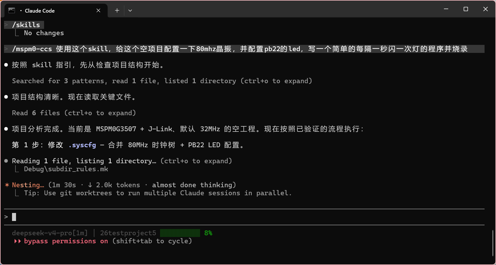
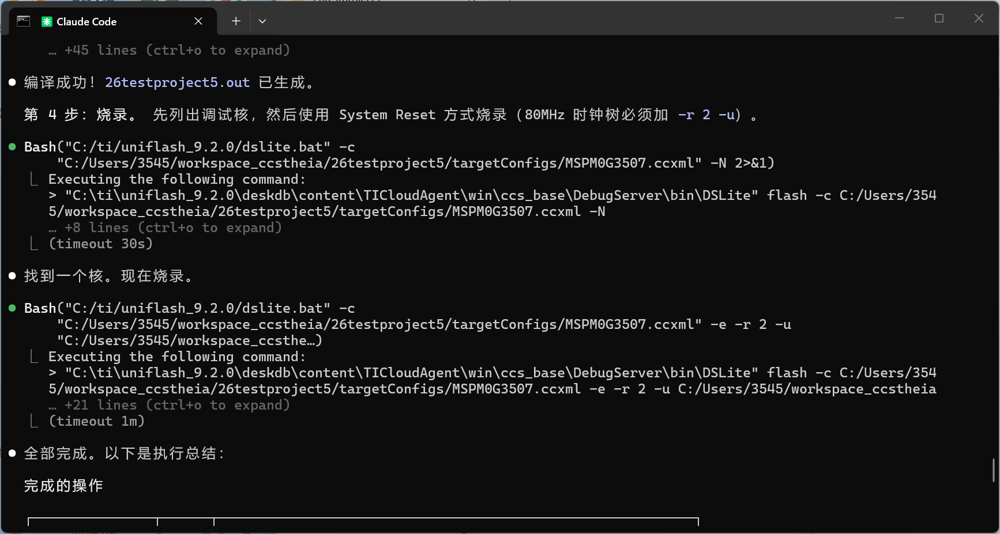
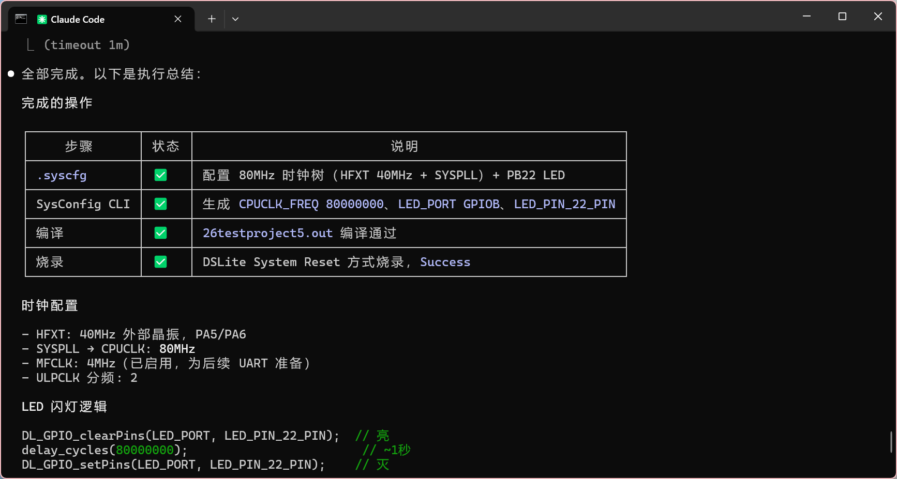

# MSPM0Skill

面向 TI MSPM0 +  SysConfig + DriverLib 的 AI 编程助手 skill 包。

本项目主要服务于国内 MSPM0 开发、电赛备赛和 TI官方开发板/立创天猛星等 MSPM0G3507 使用场景，帮助 Claude Code、OpenCode、OpenClaw、Continue、Cursor、Codex 等 CLI / 编辑器 Agent 更安全地理解和修改 MSPM0 工程。


## 主要功能
### 提供对原生MSPM0+CCS环境的支持，使AI Agent:
* **引脚配置**：通过 CLI 修改 `.syscfg` 文件初始化外设引脚
* **代码修改**：修改底层/应用层逻辑，自动编译并烧录到开发板
* **调试辅助**：串口数据收发、`.syscfg` 文件自动检查
* **例程管理**：无现成例程时自动查找官方例程文件
* **参数调优**：电机/舵机等结构的自动调参和逻辑优化

## 安装入口

真正需要安装的是这一层目录：

```text
skills/mspm0-ccs/
```

仓库根目录的 `AGENTS.md` / `CLAUDE.md` 是“开发本仓库时”的 Agent 指令，不是用户安装入口。

## 目录结构

```text
mspm0-skill/
├─ README.md
├─ AGENTS.md
├─ CLAUDE.md
└─ skills/
   └─ mspm0-ccs/
      ├─ SKILL.md
      ├─ references/
      ├─ scripts/
      ├─ assets/
      │  └─ snippets/
      └─ examples/
```

## 安装方式

### Claude Code

把 `skills/mspm0-ccs/` 复制到：

```text
~/.claude/skills/mspm0-ccs/
```

Windows PowerShell 示例：

```powershell
New-Item -ItemType Directory -Force "$env:USERPROFILE\.claude\skills" | Out-Null
Copy-Item -Recurse -Force .\skills\mspm0-ccs "$env:USERPROFILE\.claude\skills\mspm0-ccs"
```

### Codex / OpenCode / OpenClaw / 兼容 Agents 技能目录的工具

常见安装位置：

```text
~/.agents/skills/mspm0-ccs/
项目目录/.agents/skills/mspm0-ccs/
```

Windows PowerShell 示例：

```powershell
New-Item -ItemType Directory -Force "$env:USERPROFILE\.agents\skills" | Out-Null
Copy-Item -Recurse -Force .\skills\mspm0-ccs "$env:USERPROFILE\.agents\skills\mspm0-ccs"
```

OpenClaw 如果使用自己的技能目录，也可以复制到：

```text
~/.openclaw/skills/mspm0-ccs/
```

## Skill 内容

```text
skills/mspm0-ccs/
├─ SKILL.md
├─ references/
│  ├─ syscfg_rules.md
│  ├─ ccs_project_rules.md
│  ├─ driverlib_rules.md
│  ├─ common_mistakes.md
│  ├─ validated_workflow.md
│  ├─ cli_validation.md
│  ├─ reference_projects.md
│  ├─ clock_tree_rules.md
│  ├─ uart_blocking_tx.md
│  ├─ pwm_breath_led.md
│  └─ syscfg_schema_sources.md
├─ scripts/
│  ├─ check_syscfg.py
│  ├─ serial_console.py
│  └─ index_syscfg_examples.py
├─ assets/
│  ├─ snippets/
│  │  ├─ clock_80mhz_mfclk.syscfg.md
│  │  ├─ gpio_output_led.syscfg.md
│  │  ├─ uart0_blocking_tx.syscfg.md
│  │  └─ mspm0g3507_lqfp64_empty_scaffold.syscfg.md
│  └─ screenshots/
└─ examples/
   ├─ empty_project/
   ├─ led_blink/
   ├─ uart_blocking_tx/
   └─ pwm_breath_led/
```

## 已验证环境

目前已实机验证的组合是：

- 开发板：立创天猛星 MSPM0G3507
- 开发环境：CCS / CCS Theia
- SDK：MSPM0 SDK 2.10.00.04
- SysConfig：1.26.2
- 编译器：TI Arm Clang 4.0.3 LTS
- 烧录器：J-Link
- 烧录工具：UniFlash / DSLite
- 验证外设：PB22 板载 LED、UART0 阻塞发送
- 已验证时钟：80MHz CPUCLK，MFCLK 4MHz

其他开发板、芯片封装、SDK/CCS 版本、调试器或烧录方式可能也能使用本项目规则，但尚未百分百确认。迁移到其他组合时，应先运行静态检查和最小外设验证。

## 使用方式

### 从头开始
 - 将skill添加到你的Agent工具后，使用它打开你的 MSPM0 项目文件夹
 - 使用CCS (或其他编译工具) 至少编译一次空项目，然后配置你的烧录器
 - 之后开始 Vibe Coding~
### 对已有的M0项目使用
 - 建议对你的项目文件做一个描述，或设计一个AGENTS.md文件供其参考
 - 或者让Agent 读懂你的项目后直接使用即可
 - 如读串口调电机参数/写算法/初始化外设/更改项目结构等


---
安装后，在 MSPM0 工程里可以这样要求 Agent：

```text
请使用 mspm0-ccs skill，先检查当前工程的 .syscfg 和 ti_msp_dl_config.h，
然后帮我安全地配置天猛星 PB22 板载 LED。
```

或者：

```text
请使用 mspm0-ccs skill，参考 UART0 blocking TX 示例，
检查当前工程的 UART SysConfig、生成宏和串口发送代码。
```

## 使用截图

下面是 Claude Code 中调用本 skill 配置 MSPM0 工程、编译和烧录的实际使用示例：







## 脚本

Agent会在需要时自动使用对应脚本，以下为脚本单独使用示例：

静态检查当前 CCS 工程：

```powershell
python skills\mspm0-ccs\scripts\check_syscfg.py C:\Users\3545\workspace_ccstheia\26testproject1
```

串口接收测试：

```powershell
python skills\mspm0-ccs\scripts\serial_console.py --list
python skills\mspm0-ccs\scripts\serial_console.py -p COM6 -b 115200 --timestamp --duration 10
```

索引本地 TI MSPM0 SDK 的官方 SysConfig 例程和模块 metadata：

```powershell
python skills\mspm0-ccs\scripts\index_syscfg_examples.py C:\ti\mspm0_sdk_2_10_00_04 --board LP_MSPM0G3507 --module UART
```

如果 VOFA+ 或其他串口助手已经打开同一个 COM 口，Python 会无法打开该串口。测试 Python 工具前需要先关闭占用串口的软件。

## 关键经验

- `.syscfg` 是引脚、外设、时钟和生成代码的源配置文件。
- 不要手动修改 `ti_msp_dl_config.c` / `ti_msp_dl_config.h`。
- 修改 `.syscfg` 后，需要重新运行 SysConfig 或重新构建 CCS 工程。
- 不要猜生成函数和宏名，先查看生成的 `ti_msp_dl_config.h`。
- 新建 CCS 工程通常需要先手动编译一次，生成 `Debug/makefile`、`Debug/subdir_rules.mk` 和 `.out`。
- 烧录前必须确认 `targetConfigs/*.ccxml` 和实际烧录器一致。
- 自动烧录建议使用 DSLite System Reset：`-e -r 2 -u`。

## 例程说明

-  examples/ 下的目录均为我自己测试过的例程/syscfg文件，Agent会优先参考此目录下的例程作为依据
- 如果用户的要求不能在此目录下找到参考例程则会使用附带工具搜索计算机内TI SDK来获取官方例程
-  建议在使用时，提前将部分自己测试好的项目放到这个目录下供Agent参考
---

- `examples/empty_project/`：未编译空工程基线，默认 32MHz 风格。
- `examples/led_blink/`：PB22 LED 32MHz 闪灯基线。
- `examples/uart_blocking_tx/`：80MHz CPUCLK + UART0 阻塞发送字符串基线。
- `examples/pwm_breath_led/`：80MHz CPUCLK + PB22 / TIMG8_CCP1 PWM 呼吸灯基线。

## 后续计划

- 增强 Python 串口收发工具。
- 增加自动烧录封装。
- 增加更多例程。
- 完善 PID / 舵机 / 云台等参数自动调整流程。

## 参考资料

- TI SysConfig: https://www.ti.com/tool/SYSCONFIG
- TI MSPM0 SDK: https://www.ti.com/tool/MSPM0-SDK
- TI MSPM0 SysConfig Guide: https://software-dl.ti.com/msp430/esd/MSPM0-SDK/2_05_01_00/docs/english/tools/sysconfig_guide/doc_guide/doc_guide-srcs/sysconfig_guide.html
- TI LP-MSPM0G3507 https://www.ti.com.cn/tool/cn/LP-MSPM0G3507
- 立创天猛星 MSPM0G3507 文档: https://wiki.lckfb.com/zh-hans/tmx-mspm0g3507/

## 开源协议

本项目使用 MIT License，详见 [LICENSE](LICENSE)。
